<div align="center">

<!--  -->

</div>

<table>
<tr>
<td valign="top" width="46%">



</td>
<td valign="top" width="54%">

```
guest@github ~ % whoami

Name       : Filip Simonovikj
Role       : Software Engineer
Focus      : Scalable platforms & high-performance apps
Company    : @Pixaera
Building   : Immersive learning & simulation platforms

guest@github ~ % cat toolchain.cfg

Core Lang    : TypeScript, JavaScript
Backend      : Node.js, NestJS
Frontend     : React, Next.js, React Native
Database     : PostgreSQL, MongoDB, MySQL
Currently on : Node.js · NestJS · React · TS · PostgreSQL
Integrations : LMS platforms, HubSpot, live chat & events

guest@github ~ % cat about.txt

I design clean architectures, integrate complex
systems, and build reliable software that maps
to real business needs. I like the backend as
much as the pixels on screen.

guest@github ~ % cat contact.cfg

LinkedIn   : https://www.linkedin.com/in/filip-simonovikj-b1b7b019b/
Email      : filip@pixaera.com
Portfolio  : null

guest@github ~ % ./live_stats.sh
> streaming github state below ↓
```

</td>
</tr>
</table>

<br>

<div align="center">

### 📡 Live State


</div>

<br>

<div align="center">

### 🐍 Live Contribution Snake


<sub>This one truly animates and truly regenerates daily — see setup step 4 below.</sub>

</div>

<br>

<div align="center">

### 🛠️ Stack


</div>
